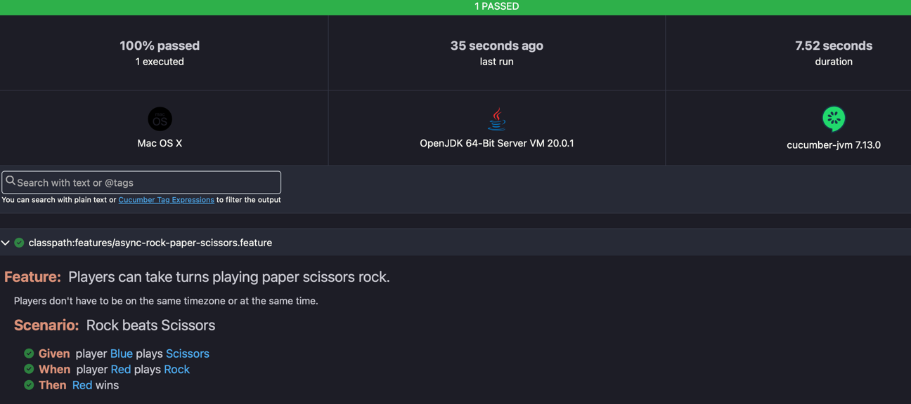

# paper-scissors-ROCK-acceptance-tests
Demo three different types of acceptance tests using Paper, Scissors, ROCK!

## Requirements
- JDK 17+ (due to Spring Boot 3 + DGS requirement)
- Gradle 8+ (should be covered by gradle wrapper)
- Docker

## Quick start
1. Build the artefact under test as a docker container: `./gradlew jibDockerBuild`
2. Run the acceptance tests `./gradlew test`
3. Open the Cucumber test HTML report `open build/reports/tests/cucumber.html`. Example Cucumber HTML report:

## Container Based - Acceptance Test
What is the artefact you are deploying? A binary or package. Or are you deploying to container Kubernetes? 
This acceptance test variant takes the published docker container and mocks all collaborating services.
The container based acceptance tests the same artefact that is going to be deployed to production. This gives any 
business a killer capability to test the same artefact that the customer will be using to and put it under its paces 
to ensure that it is of the highest quality to be given to human customers. If you are using Continuous Delivery or 
Deployment, I hope you are using some form of Container based acceptance tests in a pipeline.

Example BDD feature written in Cucumber 🥒 [src/test/resources/features/async-rock-paper-scissors.feature](src/test/resources/features/async-rock-paper-scissors.feature)

Cucumber steps map to Kotlin: [src/test/kotlin/local/mathewdj/rock/acceptance/AsyncGameStepDefinitions.kt](src/test/kotlin/local/mathewdj/rock/acceptance/AsyncGameStepDefinitions.kt)

Test container boot strapping: [src/test/kotlin/local/mathewdj/rock/acceptance/Containers.kt](src/test/kotlin/local/mathewdj/rock/acceptance/Containers.kt).
⚠️There is some complex docker networking happening here. As the artefact under test is a docker container and the DB
is also a container they must communicate via docker network. I use the network alias of postgres and the docker network
port of docker to communicate between artefact and DB.

## Just the Acceptance Criteria - Acceptance Test
You have just been given a new feature with acceptance criteria but you know it will take many weeks of development 
to deliver this feature. Don't throw away the acceptance criteria. Capture it as an acceptance test that won't be run
until the `@under-development` tag has been removed.
Example: [src/test/kotlin/local/mathewdj/rock/acceptance/AcceptanceTest.kt](src/test/kotlin/local/mathewdj/rock/acceptance/AcceptanceTest.kt)

How the `@under-development` tag was configured: [src/test/kotlin/local/mathewdj/rock/acceptance/AcceptanceTest.kt](src/test/kotlin/local/mathewdj/rock/acceptance/AcceptanceTest.kt).

## Evolved Integration Test - Acceptance Test
The evolved integration test is an incremental step from integration test to acceptance test. It is simpler than 
running a container based acceptance test because you don't need to worry about complex docker networking. Ideally
this acceptance should bring up some external services in a docker container. You can use testcontainers to start up 
supporting containers services and Spring boot to setup web tier. Scope of the test is larger than a unit test as we 
want to cover from external endpoint to the data layer and back out again.

Example [src/test/kotlin/local/mathewdj/rock/acceptance/EvolvedIntegrationTestAcceptanceTest.kt](src/test/kotlin/local/mathewdj/rock/acceptance/EvolvedIntegrationTestAcceptanceTest.kt)

🎉 Bonus tip: The example above shows an example of how you can use JUnit in a way to nest tests for those that are 
allergic to Cucumber but still like expressing tests in BDD style.
